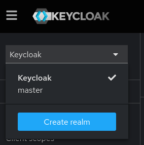
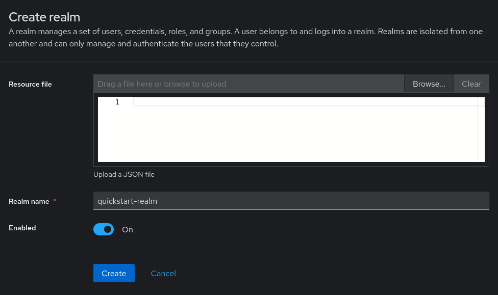
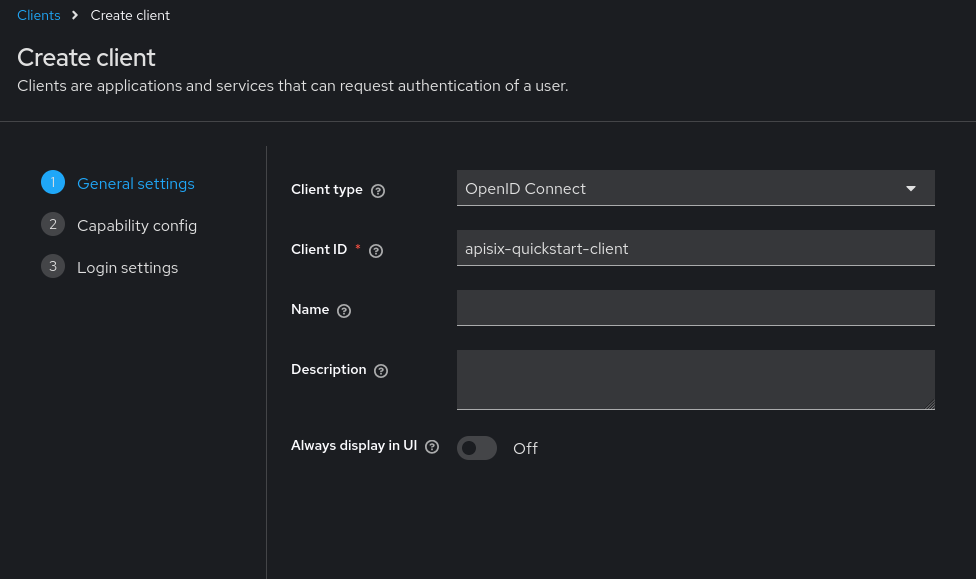
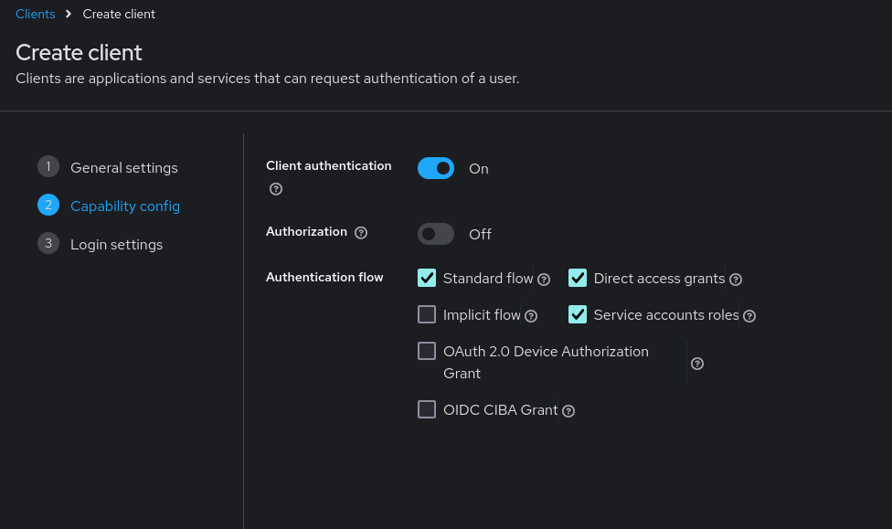
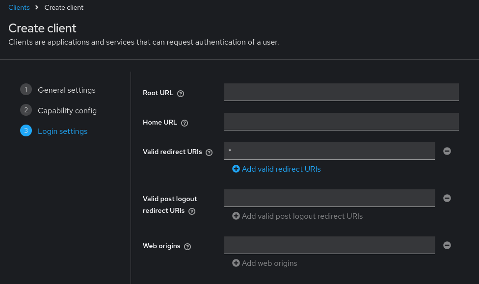
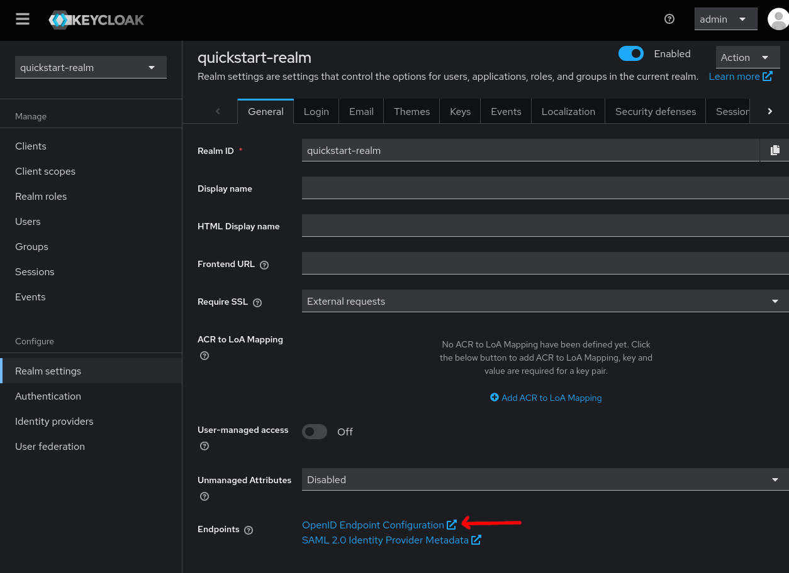
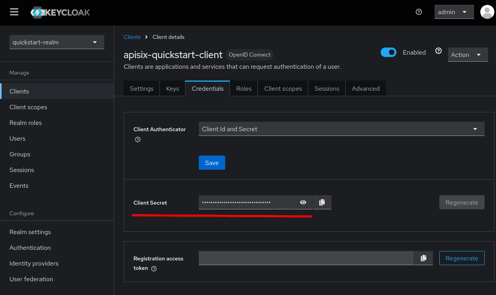
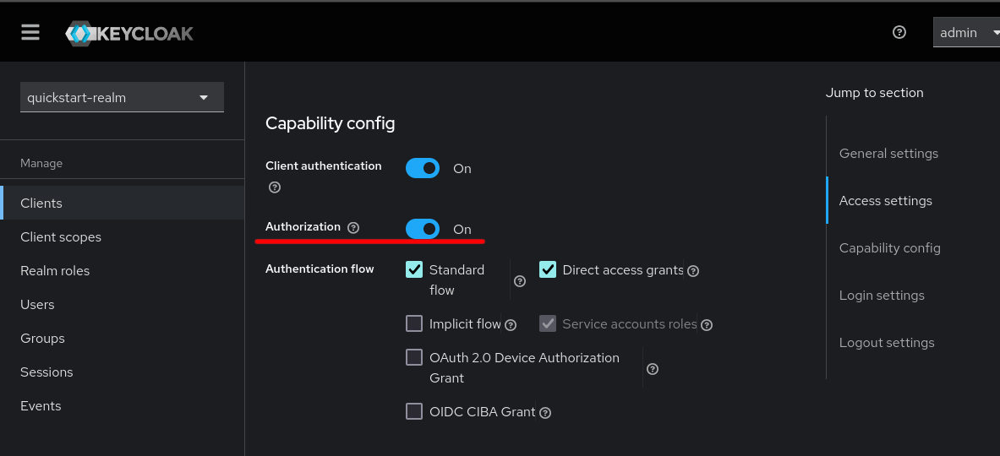
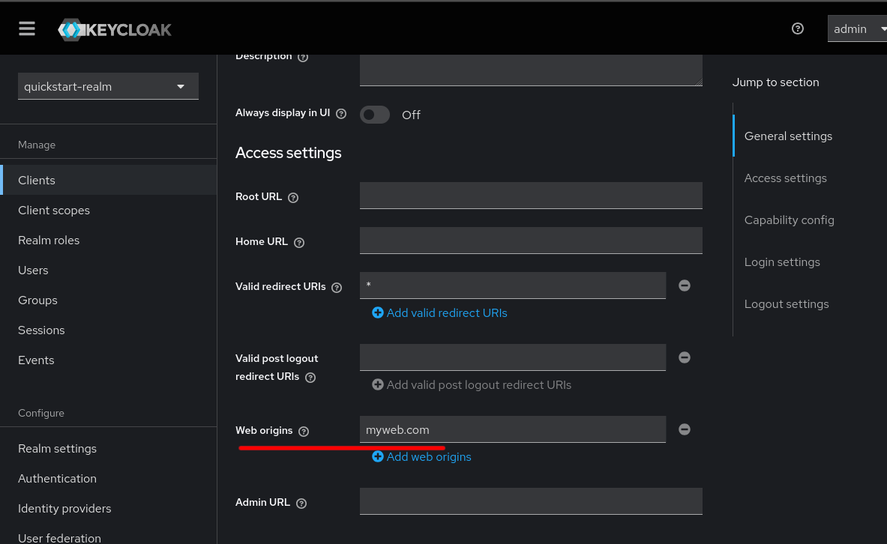
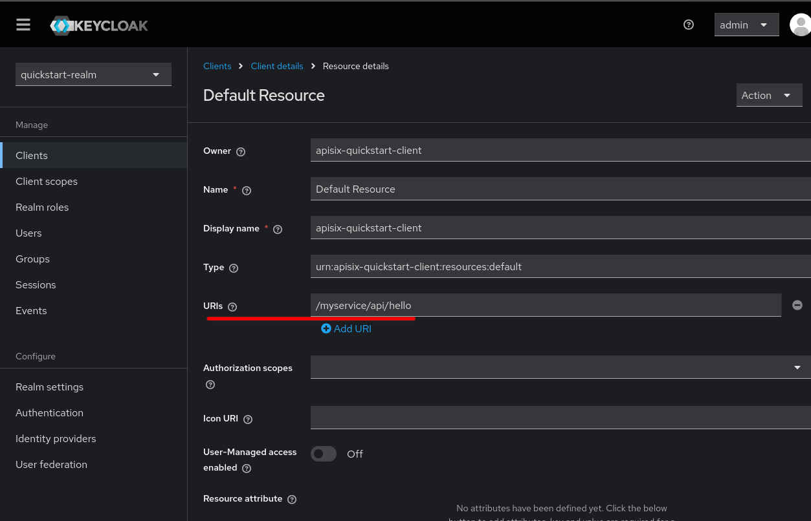

# Exemplo Apisix


## Hosts

**/etc/hosts**:

```
# Teste Apisix
192.168.56.156  myweb.com
192.168.56.156  keycloak
```

IP da VM de teste: *192.168.56.156*. Ajuste conforme necessário.


## Install docker


```sh
# Run the following command to uninstall all conflicting packages:
for pkg in docker.io docker-doc docker-compose docker-compose-v2 podman-docker containerd runc; do sudo apt-get remove $pkg; done

# Add Docker's official GPG key:
sudo apt-get -y update
sudo apt-get -y install ca-certificates curl git
sudo install -m 0755 -d /etc/apt/keyrings
sudo curl -fsSL https://download.docker.com/linux/ubuntu/gpg -o /etc/apt/keyrings/docker.asc
sudo chmod a+r /etc/apt/keyrings/docker.asc

# Add the repository to Apt sources:
echo "deb [arch=$(dpkg --print-architecture) signed-by=/etc/apt/keyrings/docker.asc] https://download.docker.com/linux/ubuntu $(. /etc/os-release && echo "$VERSION_CODENAME") stable" | sudo tee /etc/apt/sources.list.d/docker.list > /dev/null

sudo apt-get -y update

# Install docker packages
sudo apt-get -y install docker-ce docker-ce-cli containerd.io docker-buildx-plugin docker-compose-plugin

# Test
sudo docker run hello-world
```


## Apisix docker compose

Clone de repositório:

```
git clone https://github.com/lcbraz/ExemploApisix.git
```

Subir containers:

```
# Ativar
sudo docker compose -p docker-apisix up -d

# Desativar
sudo docker compose -p docker-apisix down -v
```

Exportar chave administrativa definida em *docker-compose.yaml*:

```sh
export X_API_KEY=edd1c9f034335f136f87ad84b625c8f1
```


Testar:

```sh
curl -i -H "X-API-KEY: $X_API_KEY" http://myweb.com:9180/apisix/admin/routes
```

Retorno:

```
HTTP/1.1 200 OK
Date: Fri, 25 Oct 2024 13:48:37 GMT
Content-Type: application/json
Transfer-Encoding: chunked
Connection: keep-alive
Server: APISIX/3.10.0
Access-Control-Allow-Origin: *
Access-Control-Allow-Credentials: true
Access-Control-Expose-Headers: *
Access-Control-Max-Age: 3600
X-API-VERSION: v3

{"total":0,"list":[]}
```

Apisix portas:

- **TCP/9180**: porta de gerencia
- **TCP/9080**: porta onde os serviços serão expostos (routes)


## Configuração base do Keycloak


### Criar Realm






### Criar Client



Autenticação cliente (M2M):







### Exporta variáveis de configuração


Obter endpoint de configuração do OpenID:




Obber segredo do *client*:





Exportar variáveis:

```sh
export KEYCLOAK_IP=keycloak
export OIDC_DISCOVERY=http://$KEYCLOAK_IP:8080/realms/quickstart-realm/.well-known/openid-configuration
export OIDC_CLIENT_ID=apisix-quickstart-client
export OIDC_CLIENT_SECRET=Cw4c93hzF5hwHyfqEcryxhLeSXpRzFYA  # substituir pelo segredo obtido acima
```


### Configuração autenticação client OIDC simples


Rota para obtenção do token:

```json
curl -i -H "X-API-KEY: $X_API_KEY" -X PUT http://myweb.com:9180/apisix/admin/routes -d '
{
  "id": "api-token-route",
  "uri":"/myservice/api/token",
  "plugins": {
    "proxy-rewrite": {
      "uri": "/realms/quickstart-realm/protocol/openid-connect/token"
    }
  },
  "upstream":{
    "type":"roundrobin",
    "pass_host": "rewrite",
    "upstream_host": "keycloak:8080",
    "nodes":{
      "keycloak:8080":1
    }
  }
}'
```


Retorno:

```json
HTTP/1.1 201 Created
Date: Fri, 25 Oct 2024 13:57:16 GMT
Content-Type: application/json
Transfer-Encoding: chunked
Connection: keep-alive
Server: APISIX/3.10.0
Access-Control-Allow-Origin: *
Access-Control-Allow-Credentials: true
Access-Control-Expose-Headers: *
Access-Control-Max-Age: 3600
X-API-VERSION: v3

{
  "key": "/apisix/routes/api-token-route",
  "value": {
    "status": 1,
    "id": "api-token-route",
    "update_time": 1729864636,
    "create_time": 1729864636,
    "uri": "/myservice/api/token",
    "priority": 0,
    "plugins": {
      "proxy-rewrite": {
        "uri": "/realms/quickstart-realm/protocol/openid-connect/token",
        "use_real_request_uri_unsafe": false
      }
    },
    "upstream": {
      "scheme": "http",
      "hash_on": "vars",
      "upstream_host": "keycloak:8080",
      "type": "roundrobin",
      "nodes": {
        "keycloak:8080": 1
      },
      "pass_host": "rewrite"
    }
  }
}
```

Rota do serviço principal com autenticação OIDC:


```sh
curl -i -H "X-API-KEY: $X_API_KEY" -X PUT http://myweb.com:9180/apisix/admin/routes -d '
{
  "id": "auth-oidc-route",
  "uri":"/myservice/*",
  "plugins": {
    "openid-connect": {
      "bearer_only": true,
      "client_id": "'"$OIDC_CLIENT_ID"'",
      "client_secret": "'"$OIDC_CLIENT_SECRET"'",
      "discovery": "'"$OIDC_DISCOVERY"'",
      "scope": "openid profile",
      "redirect_uri": "http://myweb.com:9080/myservice/callback"
    },
    "proxy-rewrite": {
        "regex_uri": ["^/myservice/(.*)", "/$1"]
    }
  },
  "upstream":{
    "type":"roundrobin",
    "nodes":{
      "web1:80":1,
      "web2:80":2
    }                                                                                                                                          }                                                                                                                                          }'
```

Retorno:

```
HTTP/1.1 201 Created
Date: Fri, 25 Oct 2024 14:43:22 GMT
Content-Type: application/json
Transfer-Encoding: chunked
Connection: keep-alive
Server: APISIX/3.10.0
Access-Control-Allow-Origin: *
Access-Control-Allow-Credentials: true
Access-Control-Expose-Headers: *
Access-Control-Max-Age: 3600
X-API-VERSION: v3

{"key":"/apisix/routes/auth-oidc-route","value":{"status":1,"id":"auth-oidc-route","update_time":1729867402,"create_time":1729867402,"uri":"/myservice/*","priority":0,"plugins":{"openid-connect":{"set_userinfo_header":true,"introspection_endpoint_auth_method":"client_secret_basic","revoke_tokens_on_logout":false,"set_refresh_token_header":false,"bearer_only":true,"client_id":"apisix-quickstart-client","client_secret":"PuqPwr8JwnCgW2kOzg8bDq9fdtMgxZMdcKZJQbaxVAaB525wOogiMTiWGOSMrsLC","realm":"apisix","ssl_verify":false,"redirect_uri":"http://myweb.com:9080/myservice/callback","jwt_verification_cache_ignore":false,"use_nonce":false,"timeout":3,"unauth_action":"auth","token_endpoint_auth_method":"client_secret_basic","client_jwt_assertion_expires_in":60,"introspection_interval":0,"renew_access_token_on_expiry":true,"logout_path":"/logout","iat_slack":120,"use_pkce":false,"discovery":"http://keycloak:8080/realms/quickstart-realm/.well-known/openid-configuration","set_access_token_header":true,"scope":"openid profile","accept_none_alg":false,"access_token_in_authorization_header":false,"accept_unsupported_alg":true,"jwk_expires_in":86400,"set_id_token_header":true,"force_reauthorize":false,"access_token_expires_leeway":0}},"upstream":{"scheme":"http","hash_on":"vars","type":"roundrobin","nodes":{"web2:80":2,"web1:80":1},"pass_host":"pass"}}}


```


Obtenção o token:


```sh
curl -i http://myweb.com:9080/myservice/api/token \
    --data-urlencode 'grant_type=client_credentials' \
    --data-urlencode 'client_id=apisix-quickstart-client' \
    --data-urlencode 'client_secret=GYHf9y8XKfrNMeYHSdVCzOsScWdK0dDc'
```

Retorno:


```
HTTP/1.1 200 OK
Content-Type: application/json
Content-Length: 1450
Connection: keep-alive
Cache-Control: no-store
Pragma: no-cache
Referrer-Policy: no-referrer
Strict-Transport-Security: max-age=31536000; includeSubDomains
X-Content-Type-Options: nosniff
X-Frame-Options: SAMEORIGIN
X-XSS-Protection: 1; mode=block
Server: APISIX/3.10.0


{
  "access_token": "eyJhbGciOiJSUzI1NiIsInR5cCIgOiAiSldUIiwia2lkIiA6ICJWd2huWW55QVltMkNON1otY1RObGdEdFFnNy0wTUpkWDQ3cEdGQlhhbDJvIn0.eyJleHAiOjE3Mjk4NjY1OTMsImlhdCI6MTcyOTg2NjI5MywianRpIjoiMDZhZGZiZmMtMTI5MC00YTg0LWExYmYtNWE0YWU0NzRmNWE0IiwiaXNzIjoiaHR0cDovL2tleWNsb2FrOjgwODAvcmVhbG1zL3F1aWNrc3RhcnQtcmVhbG0iLCJhdWQiOiJhY2NvdW50Iiwic3ViIjoiMzYyNDZkMjgtZWU2NC00MzZmLTllYmItOGViODlmOGVmZGMzIiwidHlwIjoiQmVhcmVyIiwiYXpwIjoiYXBpc2l4LXF1aWNrc3RhcnQtY2xpZW50IiwiYWNyIjoiMSIsInJlYWxtX2FjY2VzcyI6eyJyb2xlcyI6WyJkZWZhdWx0LXJvbGVzLXF1aWNrc3RhcnQtcmVhbG0iLCJvZmZsaW5lX2FjY2VzcyIsInVtYV9hdXRob3JpemF0aW9uIl19LCJyZXNvdXJjZV9hY2Nlc3MiOnsiYWNjb3VudCI6eyJyb2xlcyI6WyJtYW5hZ2UtYWNjb3VudCIsIm1hbmFnZS1hY2NvdW50LWxpbmtzIiwidmlldy1wcm9maWxlIl19fSwic2NvcGUiOiJlbWFpbCBwcm9maWxlIiwiZW1haWxfdmVyaWZpZWQiOmZhbHNlLCJjbGllbnRIb3N0IjoiMTcyLjE4LjAuOCIsInByZWZlcnJlZF91c2VybmFtZSI6InNlcnZpY2UtYWNjb3VudC1hcGlzaXgtcXVpY2tzdGFydC1jbGllbnQiLCJjbGllbnRBZGRyZXNzIjoiMTcyLjE4LjAuOCIsImNsaWVudF9pZCI6ImFwaXNpeC1xdWlja3N0YXJ0LWNsaWVudCJ9.JYhA8tLQRjmvCcOfpIxgXgLQMw2Nxc4E12L8gsiY4jgfshNSAnEgSjvNSjtgTDiD8ZolRHTU5HN0yOREW-nT8SiXJ6rSb26H8Jr902qMj_tNY4bukkkAXQL8vydxNT-PAauq_jQzxVf6T3ErG-mGwebaZlvXtysg0mE4BOKVI2C0gyCInRt-1HvEwIWuPOnKbtgjs_FW8-TgmiOJzlGHBzsYh-wkfq8TNJJl9E0I_lnkv4TwgetgTS2o6u4g8wd41zOWgsHs22SyWGF1zMQu15N9J-9Uw-NdUxCkzitzxmS7tHfp_lqOBEHSXmJ_L8-994frh2zHExvQyySPlzEBYg",
  "expires_in": 300,
  "refresh_expires_in": 0,
  "token_type": "Bearer",
  "not-before-policy": 0,
  "scope": "email profile"
}
```


Para facilitar os testes salvar o token direto para uma variável do shell:


```sh
token=$(curl -s http://myweb.com:9080/myservice/api/token --data-urlencode \
    'grant_type=client_credentials' \
    --data-urlencode 'client_id=apisix-quickstart-client' \
    --data-urlencode 'client_secret=GYHf9y8XKfrNMeYHSdVCzOsScWdK0dDc' | jq -r .access_token)
```


Requisição autenticada:

```sh
curl http://myweb.com:9080/myservice/api/hello -H "Authorization: Bearer $token"

# retorno
web1 hello
# Ou
web2 hello
```

Requisição sem autenticação:


```sh
curl -i http://myweb.com:9080/myservice/api/hello
```

Retorno:

```
HTTP/1.1 401 Unauthorized
Date: Fri, 25 Oct 2024 15:07:16 GMT
Content-Type: text/html; charset=utf-8
Content-Length: 251
Connection: keep-alive
WWW-Authenticate: Bearer realm="apisix"
Server: APISIX/3.10.0

<html>
<head><title>401 Authorization Required</title></head>
<body>
<center><h1>401 Authorization Required</h1></center>
<hr><center>openresty</center>
<p><em>Powered by <a href="https://apisix.apache.org/">APISIX</a>.</em></p></body>
</html>
```

### Autenficação OIDC com autorização (permissão granular)


Apagar rota de autenticação simples:

```sh
curl -i -H "X-API-KEY: $X_API_KEY" -X DELETE http://myweb.com:9180/apisix/admin/routes/auth-oidc-route
```

Retono:

```
HTTP/1.1 200 OK
Date: Fri, 25 Oct 2024 15:12:17 GMT
Content-Type: application/json
Transfer-Encoding: chunked
Connection: keep-alive
Server: APISIX/3.10.0
Access-Control-Allow-Origin: *
Access-Control-Allow-Credentials: true
Access-Control-Expose-Headers: *
Access-Control-Max-Age: 3600
X-API-VERSION: v3

{"deleted":"1","key":"/apisix/routes/auth-oidc-route"}
```


Criar rota com autenticação e autorização:


```sh
curl -i -H "X-API-KEY: $X_API_KEY" -X PUT http://myweb.com:9180/apisix/admin/routes -d '
{
  "id": "authz-keycloak-route",
  "uri":"/myservice/*",
  "plugins": {
    "authz-keycloak": {
        "lazy_load_paths": true,
        "resource_registration_endpoint": "http://'"$KEYCLOAK_IP"':8080/realms/quickstart-realm/authz/protection/resource_set",
        "discovery": "http://'"$KEYCLOAK_IP"':8080/realms/quickstart-realm/.well-known/uma2-configuration",
        "client_id": "'"$OIDC_CLIENT_ID"'",
        "client_secret": "'"$OIDC_CLIENT_SECRET"'"
    },
    "proxy-rewrite": {
        "regex_uri": ["^/myservice/(.*)", "/$1"]
    }
  },
  "upstream":{
    "type":"roundrobin",
    "nodes":{
      "web1:80":1,
      "web2:80":2
    }
  }
}'
```

Retorno:


```
HTTP/1.1 201 Created
Date: Fri, 25 Oct 2024 14:16:28 GMT
Content-Type: application/json
Transfer-Encoding: chunked
Connection: keep-alive
Server: APISIX/3.10.0
Access-Control-Allow-Origin: *
Access-Control-Allow-Credentials: true
Access-Control-Expose-Headers: *
Access-Control-Max-Age: 3600
X-API-VERSION: v3


{
  "key": "/apisix/routes/authz-keycloak-route",
  "value": {
    "status": 1,
    "id": "authz-keycloak-route",
    "update_time": 1729865788,
    "create_time": 1729865788,
    "uri": "/myservice/*",
    "priority": 0,
    "plugins": {
      "authz-keycloak": {
        "permissions": {},
        "policy_enforcement_mode": "ENFORCING",
        "lazy_load_paths": true,
        "http_method_as_scope": false,
        "cache_ttl_seconds": 86400,
        "access_token_expires_in": 300,
        "access_token_expires_leeway": 0,
        "refresh_token_expires_in": 3600,
        "refresh_token_expires_leeway": 0,
        "timeout": 3000,
        "client_id": "apisix-quickstart-client",
        "discovery": "http://keycloak:8080/realms/quickstart-realm/.well-known/uma2-configuration",
        "client_secret": "PuqPwr8JwnCgW2kOzg8bDq9fdtMgxZMdcKZJQbaxVAaB525wOogiMTiWGOSMrsLC",
        "resource_registration_endpoint": "http://keycloak:8080/realms/quickstart-realm/authz/protection/resource_set",
        "keepalive_timeout": 60000,
        "ssl_verify": true,
        "keepalive_pool": 5,
        "keepalive": true,
        "grant_type": "urn:ietf:params:oauth:grant-type:uma-ticket"
      },
      "proxy-rewrite": {
        "regex_uri": [
          "^/myservice/(.*)",
          "/$1"
        ],
        "use_real_request_uri_unsafe": false
      }
    },
    "upstream": {
      "scheme": "http",
      "hash_on": "vars",
      "type": "roundrobin",
      "nodes": {
        "web2:80": 2,
        "web1:80": 1
      },
      "pass_host": "pass"
    }
  }
}
```

Ativar autorização para o *client* no keycloak:





Liberar o CORS (para o teste é possível usar '*'):





Testar vários endpoints:


```sh
curl http://myweb.com:9080/myservice/api/hello -H "Authorization: Bearer $token"
curl http://myweb.com:9080/myservice/api/web -H "Authorization: Bearer $token"
curl http://myweb.com:9080/myservice/api/ -H "Authorization: Bearer $token"

# Retornos (pode retornar web1 ou web2):
web2 hello
web1
web2 home
```

Configurar permissão específica:





Requisição autenticada na URL permitida:

```sh
curl http://myweb.com:9080/myservice/api/hello -H "Authorization: Bearer $token"

# retorno
web1 hello
```


Requisição autenticada na URL não permitida:

```sh
curl -i http://myweb.com:9080/myservice/api/ -H "Authorization: Bearer $token"
```

Retorno:

```sh
HTTP/1.1 403 Forbidden
Date: Fri, 25 Oct 2024 16:09:26 GMT
Content-Type: text/plain; charset=utf-8
Transfer-Encoding: chunked
Connection: keep-alive
Server: APISIX/3.10.0

{"error":"access_denied","error_description":"not_authorized"}⏎
```

## Referências


- https://docs.api7.ai/apisix/how-to-guide/authentication/set-up-sso-with-keycloak
- https://docs.api7.ai/hub/openid-connect
- https://docs.api7.ai/hub/authz-keycloak
- https://www.keycloak.org/docs/latest/authorization_services/
